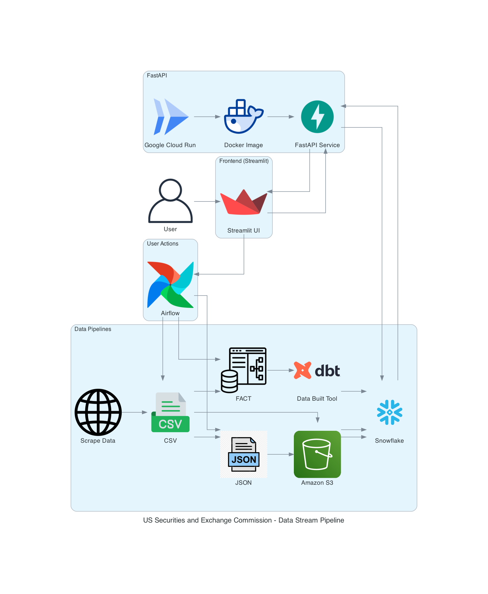

# SEC Bridge

## Project Overview

Emphasizing financial data processing and pipeline automation

EC-Bridge is a financial data pipeline and analysis system designed to extract, transform, and validate SEC financial statement data efficiently. The project aims to support analysts conducting fundamental analysis of US public companies by building a robust, scalable, and structured financial database using Snowflake, Airflow, FastAPI, and Streamlit.

## Team Members

- Vedant Mane
- Abhinav Gangurde
- Yohan Markose

## Attestation:

WE ATTEST THAT WE HAVEN’T USED ANY OTHER STUDENTS’ WORK IN OUR ASSIGNMENT AND ABIDE BY THE POLICIES LISTED IN THE STUDENT HANDBOOK

## Resources

Application: [Streamlit Deployment](https://webpdfdataextractiontool.streamlit.app/)

Backend API: [Google Cloud Run](https://fastapi-service-rhtrkfwlfq-uc.a.run.app/docs)

Google Codelab: [Codelab](https://codelabs-preview.appspot.com/?file_id=1xwrkjouN6SqtHA2sCEjKclfBJKb0yfX7YK_DwzOorpM#0)

Google Docs: [Project Document](https://docs.google.com/document/d/1xwrkjouN6SqtHA2sCEjKclfBJKb0yfX7YK_DwzOorpM/edit?usp=sharing)

Video Walkthrough: [Video](https://drive.google.com/file/d/1gRAybJijrtRXynX8-bh1Lo14EUulq4xh/view?usp=sharing)

## Technologies Used

- **Streamlit**: Frontend Framework
- **FastAPI**: API Framework
- **Google Cloud Run**: Backend Deployment
- **AWS S3**: External Cloud Storage
- **Cloud & Storage**: Snowflake, AWS S3
- **ELT & Pipeline**: Apache Airflow
- **Programming**: Python, SQL, JSON Transformation
- **Validation & Testing**: DBT (Data Built Tool)

## Application Workflow Diagram



### Workflow
### 1. Initial User Input

- SEC files are quarterly financial reports
- Users select: year, quarter, and processing pipeline (RAW/JSON/Fact Tables)

### 2. Airflow Processing

- Triggers appropriate pipeline based on user selection
- RAW Pipeline:
    - Stores SEC file in S3
    - Converts to CSV format
    - Loads to Snowflake as VARCHAR
    - Creates processed tables with correct datatypes
- Fact Tables Pipeline:
    - Loads S3 data to Snowflake
    - Uses DBT for staging views
    - Creates fact tables for Balance Sheet, Income Statement, and Cash Flow
- JSON Pipeline:
    - Converts SEC files to parquet
    - Generates company-specific JSON files
    - Loads to Snowflake as VARIANT type

### 3. Secondary User Interface

- Users can verify data availability for specific year/quarter
- Run custom queries on available tables

### 4. Data Retrieval

- FastAPI handles database connections
- Returns query results to Streamlit interface

## Environment Setup

```
Required Python Version 3.12.*
```

### 1. Clone the Repository

```bash
git clone https://github.com/BigDataIA-Spring2025-4/DAMG7245_Assignment02.git
cd DAMG7245_Assignment02
```

### 2. Setting up the virtual environment

```bash
python -m venv venvsource venv/bin/activate
pip install -r requirements.txt
```
### Seting Up Airflow

Create a new directory for your Airflow setup and navigate into it:

### 3. AWS S3 Setup

**Step 1: Create an AWS Account**

- Go to [AWS Signup](https://aws.amazon.com/) and click **Create an AWS Account**.
- Follow the instructions to enter your email, password, and billing details.
- Verify your identity and choose a support plan.

**Step 2: Log in to AWS Management Console**

- Visit [AWS Console](https://aws.amazon.com/console/) and log in with your credentials.
- Search for **S3** in the AWS services search bar and open it.

**Step 3: Create an S3 Bucket**

- Click **Create bucket**.
- Enter a unique **Bucket name**.
- Select a region closest to your users.
- Configure settings as needed (e.g., versioning, encryption).
- Click **Create bucket** to finalize.

### 4. Google Cloud SDK Setup

**Step 1: Download and Install Google Cloud SDK**

- Visit the [Google Cloud SDK documentation](https://cloud.google.com/sdk/docs/install) for platform-specific installation instructions.
- Download the installer for your operating system (Windows, macOS, or Linux).
- Follow the installation steps provided for your system.

**Step 2: Initialize Google Cloud SDK**

- Open a terminal or command prompt.
- Run `gcloud init` to begin the setup process.
- Follow the prompts to log in with your Google account and select a project.

**Step 3: Verify Installation**

- Run `gcloud --version` to confirm installation.
- Use `gcloud config list` to check the active configuration.

### 5. Setting up the Docker Image on Google Cloud Run

1. **Build the Docker Image**

```docker
# Build and tag your image (make sure you're in the project directory)
docker build --platform=linux/amd64 --no-cache -t gcr.io/<YOUR_PROJECT_ID>/fastapi-app .

```

2. **Test Locally (Optional but Recommended)**

```docker
# Run the container locally
docker run -p 8080:8080 gcr.io/<YOUR_PROJECT_ID>/fastapi-app

# For Managing Environment Variables
docker run --env-file .env -p 8080:8080 gcr.io/<YOUR_PROJECT_ID>/fastapi-app
```

Visit http://localhost:8080/docs to verify the API works.

3. **Push to Google Container Registry**

```docker
# Push the image
docker push gcr.io/<YOUR_PROJECT_ID>/fastapi-app
```

4. **Deploy to Cloud Run**

```bash
gcloud run deploy fastapi-service \
  --image gcr.io/<YOUR_PROJECT_ID>/fastapi-app \
  --platform managed \
  --region us-central1 \
  --allow-unauthenticated  
```

5. Get your Service URL

```bash
gcloud run services describe fastapi-service \
  --platform managed \
  --region <REGION> \
  --format 'value(status.url)'
```

6. Check Application Logs

```bash
gcloud run services logs read fastapi-service --region <REGION>
```

## References

[Streamlit documentation](https://docs.streamlit.io/)

[SQLAlchemy Integration](https://fastapi.tiangolo.com/tutorial/sql-databases/)

[FastAPI Documentation](https://fastapi.tiangolo.com/)

[Apache Airflow](https://airflow.apache.org/docs/)

[Snowflake Code Lab]( https://quickstarts.snowflake.com/guide/getting_started_with_snowflake/index.html#0)

[Snowflake Python Connector](https://docs.snowflake.com/en/user-guide/python-connector)

[DBT](https://docs.getdbt.com/)

[Snowflake, Airflow, DBT Code Lab](https://quickstarts.snowflake.com/guide/data_engineering_with_apache_airflow/index.html?index=..%2F..index#0)
